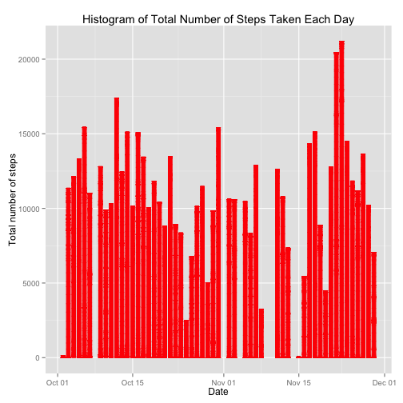
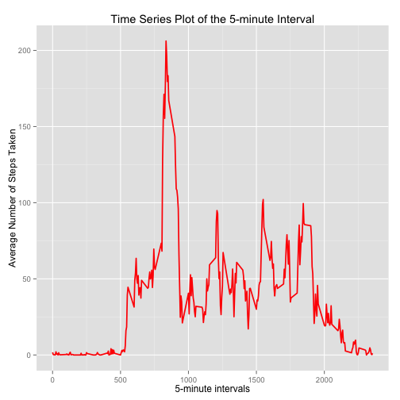
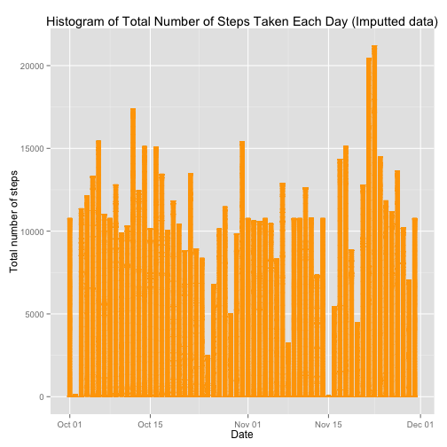

### Global Setting  


```r
echo = TRUE  # Show Code
options(scipen = 1)  # Disable numeric scientific notations
```
### Loading and preprocessing the data  


```r
activity <- read.csv("activity.csv", colClasses = c("integer", "Date", "integer"))
dfnona <- na.omit(activity)
head(dfnona)
```

```
##     steps       date interval
## 289     0 2012-10-02        0
## 290     0 2012-10-02        5
## 291     0 2012-10-02       10
## 292     0 2012-10-02       15
## 293     0 2012-10-02       20
## 294     0 2012-10-02       25
```

```r
library(ggplot2)
library(lattice)
library(lubridate)
library(dplyr)
```

### What is mean total number of steps taken per day?  
For this part of the assignment, you can ignore the missing values in the dataset.   
1. Make a histogram of the total number of steps taken each day.

```r
ggplot(dfnona, aes(date, steps)) + 
        geom_bar(stat = "identity", colour = "red", fill = 'red', width = 0.7) + 
        labs(title = "Histogram of Total Number of Steps Taken Each Day", 
             x = "Date", y = "Total number of steps")
```

 
 
2. Calculate and report the mean and median total number of steps taken per day.  

```r
totalstep <- summarise(group_by(dfnona, date), dailystep = sum(steps))
```
Mean total number of steps taken per day:

```r
mean(totalstep$dailystep)
```

```
## [1] 10766.19
```
Median total number of steps taken per day:

```r
median(totalstep$dailystep)
```

```
## [1] 10765
```

### What is the average daily activity pattern?
1. Make a time series plot (i.e. type = "l") of the 5-minute interval (x-axis) and the average number of steps taken, averaged across all days (y-axis)  


```r
averagestep <- summarise(group_by(dfnona, interval), meanstep = mean(steps))
head(averagestep)
```

```
## Source: local data frame [6 x 2]
## 
##   interval  meanstep
## 1        0 1.7169811
## 2        5 0.3396226
## 3       10 0.1320755
## 4       15 0.1509434
## 5       20 0.0754717
## 6       25 2.0943396
```

```r
ggplot(averagestep, aes(interval, meanstep)) + 
        geom_line(color = "red",size = 0.8) + 
        labs(title = "Time Series Plot of the 5-minute Interval", 
             x = "5-minute intervals", y = "Average Number of Steps Taken")
```

 

2. Which 5-minute interval, on average across all the days in the dataset, contains the maximum number of steps?  


```r
averagestep[averagestep$meanstep == max(averagestep$meanstep),]
```

```
## Source: local data frame [1 x 2]
## 
##     interval meanstep
## 104      835 206.1698
```

### Imputing missing values  
1. Calculate and report the total number of missing values in the dataset (i.e. the total number of rows with NAs)  


```r
sum(is.na(activity))
```

```
## [1] 2304
```

2. Devise a strategy for filling in all of the missing values in the dataset. The strategy does not need to be sophisticated. For example, you could use the mean/median for that day, or the mean for that 5-minute interval, etc.  

I will be using the mean for the 5-minute interval to fill in the missing value in the dataset.  

3. Create a new dataset that is equal to the original dataset but with the missing data filled in.  


```r
# Exract row with NA from the dataset
dfna <- subset(activity, is.na(activity$steps))
head(dfna)
```

```
##   steps       date interval
## 1    NA 2012-10-01        0
## 2    NA 2012-10-01        5
## 3    NA 2012-10-01       10
## 4    NA 2012-10-01       15
## 5    NA 2012-10-01       20
## 6    NA 2012-10-01       25
```

```r
# merged record with mean of the 5 min interval
merged_df <- merge(dfna, averagestep, by.x = c("interval"), by.y = c("interval"))
# select only requird column
merged_df <- select(merged_df,meanstep,date,interval)
# rename column name meanstep to step
colnames(merged_df)[1] <- "steps"
head(merged_df)
```

```
##      steps       date interval
## 1 1.716981 2012-10-01        0
## 2 1.716981 2012-11-30        0
## 3 1.716981 2012-11-04        0
## 4 1.716981 2012-11-09        0
## 5 1.716981 2012-11-14        0
## 6 1.716981 2012-11-10        0
```

```r
# combine dataset to form new dataset
dfnew <- rbind(dfnona,merged_df)
head(dfnew)
```

```
##     steps       date interval
## 289     0 2012-10-02        0
## 290     0 2012-10-02        5
## 291     0 2012-10-02       10
## 292     0 2012-10-02       15
## 293     0 2012-10-02       20
## 294     0 2012-10-02       25
```

```r
sum(is.na(dfnew))
```

```
## [1] 0
```
4. Make a histogram of the total number of steps taken each day.    


```r
ggplot(dfnew, aes(date, steps)) + 
        geom_bar(stat = "identity", colour = "orange", fill = 'orange', width = 0.7) + 
        labs(title = "Histogram of Total Number of Steps Taken Each Day (Imputted data)", 
             x = "Date", y = "Total number of steps")
```

 

Calculate and report the mean and median total number of steps taken per day.

```r
newtotalstep <- summarise(group_by(dfnew, date), dailystep = sum(steps))
```

Mean total number of steps taken per day:  

```r
mean(newtotalstep$dailystep)
```

```
## [1] 10766.19
```

Median total number of steps taken per day:

```r
median(newtotalstep$dailystep)
```

```
## [1] 10766.19
```

5. Do these values differ from the estimates from the first part of the assignment? What is the impact of imputing missing data on the estimates of the total daily number of steps?  
The mean has the same value of 10766.19 for both orignal data set and inputted data set, however the median value for the inputted data set is higher compared to the previous data set with missiong data.  

### Are there differences in activity patterns between weekdays and weekends?  
1. Create a new factor variable in the dataset with two levels – “weekday” and “weekend” indicating whether a given date is a weekday or weekend day.  


```r
# Create a lookup table for weekday and weekend
cal_lookup <- c("weekend",rep("weekday",5),"weekend")
cal_lookup
```

```
## [1] "weekend" "weekday" "weekday" "weekday" "weekday" "weekday" "weekend"
```

```r
# Indicate date either weekend or weekday
new_data <- mutate(dfnew, weekdays = wday(date), weeks = cal_lookup[weekdays])
new_data <- select(new_data, -weekdays)
new_data$weeks <- as.factor(new_data$weeks)
str(new_data)
```

```
## 'data.frame':	17568 obs. of  4 variables:
##  $ steps   : num  0 0 0 0 0 0 0 0 0 0 ...
##  $ date    : Date, format: "2012-10-02" "2012-10-02" ...
##  $ interval: int  0 5 10 15 20 25 30 35 40 45 ...
##  $ weeks   : Factor w/ 2 levels "weekday","weekend": 1 1 1 1 1 1 1 1 1 1 ...
```

```r
head(new_data) 
```

```
##   steps       date interval   weeks
## 1     0 2012-10-02        0 weekday
## 2     0 2012-10-02        5 weekday
## 3     0 2012-10-02       10 weekday
## 4     0 2012-10-02       15 weekday
## 5     0 2012-10-02       20 weekday
## 6     0 2012-10-02       25 weekday
```

2. Make a panel plot containing a time series plot (i.e. type = "l") of the 5-minute interval (x-axis) and the average number of steps taken, averaged across all weekday days or weekend days (y-axis).


```r
averagestep <- summarise(group_by(new_data, interval, weeks), meanstep = mean(steps))
head(averagestep)
```

```
## Source: local data frame [6 x 3]
## Groups: interval
## 
##   interval   weeks   meanstep
## 1        0 weekday 2.25115304
## 2        0 weekend 0.21462264
## 3        5 weekday 0.44528302
## 4        5 weekend 0.04245283
## 5       10 weekday 0.17316562
## 6       10 weekend 0.01650943
```

```r
xyplot(averagestep$meanstep ~ averagestep$interval | averagestep$weeks, 
       layout = c(1, 2), type = "l", 
       xlab = "Interval", ylab = "Number of steps")
```

 


